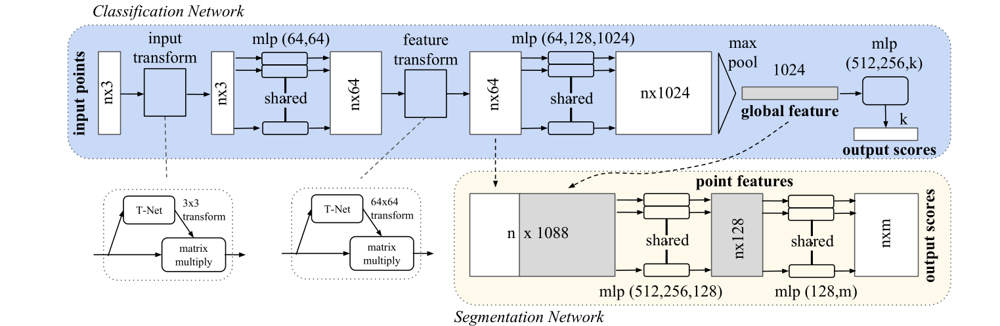
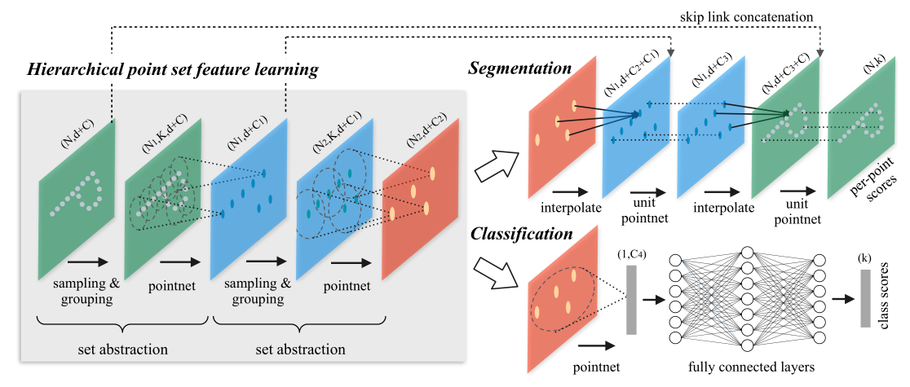

# pointnet-pointnet2

a Pytorch implimentation of PointNet and PointNet++

**PointNet**：

**PoinNet++**:

## links

- [PointNet: Deep Learning on Point Sets for 3D Classification and Segmentation](https://ieeexplore.ieee.org/document/8099499/)

- [PointNet++: Deep Hierarchical Feature Learning on Point Sets in a Metric Space](http://papers.nips.cc/paper/7095-pointnet-deep-hierarchical-feature-learning-on-point-sets-in-a-metric-space)

- [ModelNet40](https://shapenet.cs.stanford.edu/media/modelnet40_ply_hdf5_2048.zip)

